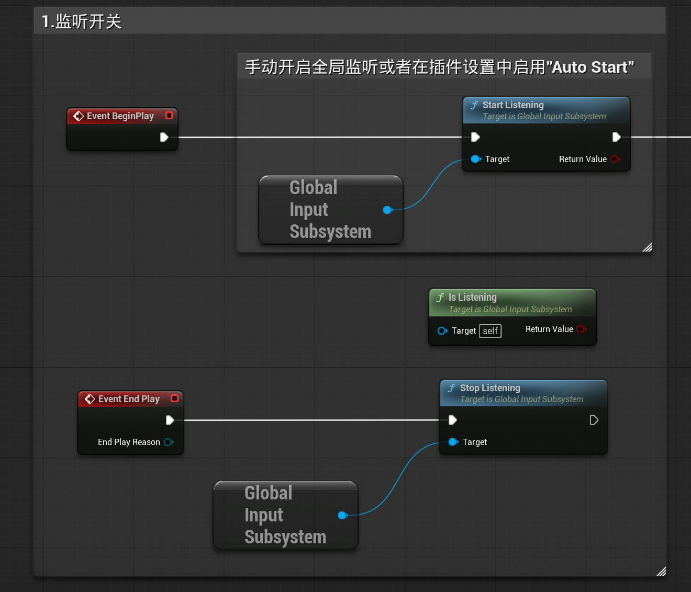
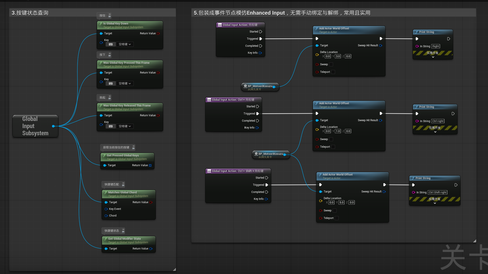
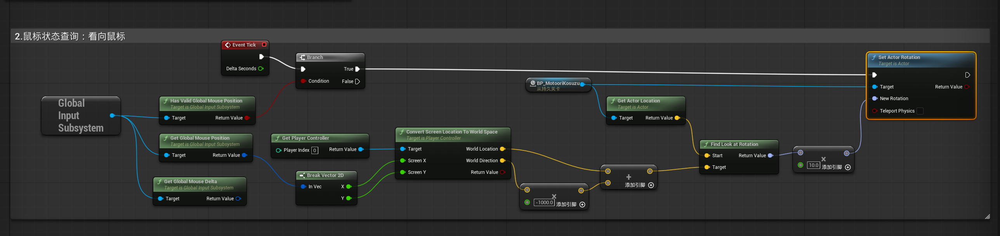
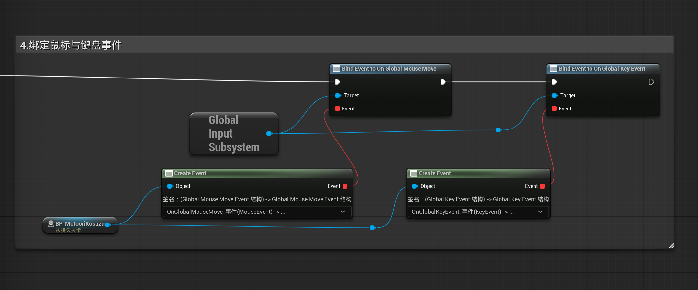
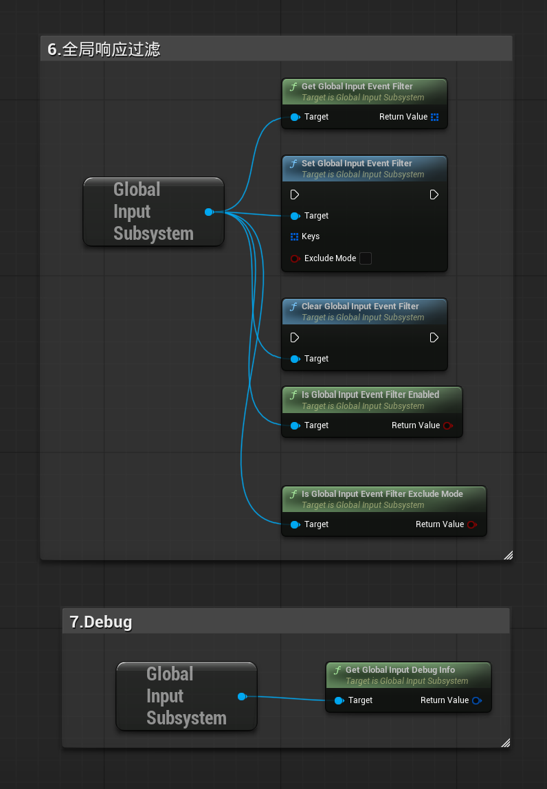

# Global Input Bridge

[](LICENSE) [](https://unrealengine.com) [](https://learn.microsoft.com/windows/)
[](CHANGELOG.md) [](https://github.com/xiaoyaomoyor/GlobalInputBridge/stargazers) [](https://github.com/xiaoyaomoyor/GlobalInputBridge/network/members) [](https://github.com/xiaoyaomoyor/GlobalInputBridge/issues)

> **Vibe-Coding Disclosure**: The development of this plugin was assisted by AI-assisted programming (vibe coding).

**English** | [简体中文](README.zh-CN.md)

Global Input Bridge is a feature-rich Windows input plugin for Unreal Engine that delivers **focus-independent global keyboard and mouse input** to the game thread — even when your UE application is in the background.

It is built for workflows where UE is a companion app running behind a foreground program: **virtual avatar streaming** (mirroring aim and movement while playing an FPS), macro panels, input analytics, overlay tools, and similar scenarios.

> Highlights: mouse aim deltas keep flowing even in raw-input FPS games that pin the system cursor to the screen center (e.g. Hunt: Showdown), because movement is read from `WM_INPUT` raw relative deltas — the same data the game itself consumes.

## Features

- **Global keyboard** — background Windows Raw Input worker thread (`RIDEV_INPUTSINK`); receives keys regardless of window focus, with multi-device aggregation and hot-plug handling.
- **Global mouse movement** — four tracking modes, defaulting to Raw Input relative deltas:
  - `Raw Input` (default): per-frame aggregated `RAWMOUSE.lLastX/lLastY` counts — unaffected by cursor locking, pointer acceleration, or DPI scaling.
  - `Polling`: desktop pixel deltas via `GetCursorPos`.
  - `Buttons Only` / `Disabled`.
- **Global Input Action Event** blueprint node with an Enhanced-Input-like lifecycle (`Started` / `Triggered` / `Completed`), modifier chords, and optional exclusive modifier matching — no manual Bind/Unbind.
- **State queries** — `Is Global Key Down`, `Was Global Key Pressed/Released This Frame`, `Get Pressed Global Keys`, modifier state.
- **Broadcast events** — `On Global Key Event` and `On Global Mouse Move`.
- **Event filtering** — allow-list or exclude-list that gates `On Global Key Event` broadcasts and the Started/Triggered phases of Global Input Action Events, never state tracking.
- **Debugging** — `Get Global Input Debug Info` snapshot plus configurable log levels.
- **Automation tests** for the state manager, chord binding manager, subsystem lifecycle, key mapping, and editor node compilation.

The plugin is a passive input *reader*: it never injects or synthesizes input, and does not replace Enhanced Input in your project.

## Requirements

- Unreal Engine 5.7 (developed and tested; other UE 5.x versions may compile but are untested)
- Windows x64 (the plugin only loads on Win64)

## Installation

1. Clone or download this repository into your project:

   ```
   <YourProject>/Plugins/GlobalInputBridge
   ```

2. Regenerate project files and compile (or simply launch the project and let the editor build the plugin).
3. Enable the plugin if prompted. Settings live in `Project Settings > Plugins > Global Input Bridge`.

## Quick Start (Blueprint)

> The plugin ships a DemoMap in its Content folder — open it to see blueprint examples for every feature below.

1. Get the subsystem with `Get Engine Subsystem` → `GlobalInputSubsystem`.

   

2. Either enable **Auto Start** in the settings or call `Start Listening` yourself (Commandlets and dedicated servers never auto-start).
3. For continuous behavior, query `Is Global Key Down`.
4. For one-shot behavior, query `Was Global Key Pressed This Frame` / `Was Global Key Released This Frame`.

   

5. For mouse aim, read `Get Global Mouse Delta` every tick or bind `On Global Mouse Move`.

   

6. Add the purple **Global Input Action Event** node for key actions; configure Key, Modifiers, and the optional `Exact Modifiers (Exclusive)` in Details.

   

A typical aim-mirroring setup: accumulate `Get Global Mouse Delta` each tick, scale by a sensitivity factor, and drive an Aim Offset. Raw Input deltas are device counts (no pointer acceleration), so tune the scale factor to taste.

## Mouse Tracking Modes

Configurable in `Project Settings > Plugins > Global Input Bridge`:

| Mode | Movement delta | Buttons | Desktop position | Notes |
|---|---|---|---|---|
| `Raw Input` (default) | Raw relative counts (`WM_INPUT`) | Polled | Polled | Works in cursor-locked FPS games; same data the game consumes |
| `Polling` | Desktop pixel diff | Polled | Polled | Desktop-like semantics; zero delta in cursor-locked games |
| `Buttons Only` | None | Polled | Not queried | `On Global Mouse Move` is never broadcast |
| `Disabled` | None | Not polled | Not queried | Keyboard listening is unaffected in all modes |

## How It Works

- A dedicated worker thread runs a hidden Win32 message window and registers keyboard and (in Raw Input mode) mouse collections with `RIDEV_INPUTSINK`, receiving input system-wide without focus. Packets flow through a single-producer/single-consumer queue and are consumed on the game thread inside the engine subsystem's tick.
- Mouse buttons and the desktop cursor position are polled on the game thread via `GetAsyncKeyState` / `GetCursorPos`.
- **Registration heartbeat**: Windows allows only one Raw Input target window per device class *within a process* — the last registration wins. UE's own viewport high-precision mouse mode (viewport click, PIE, mouse capture) repeatedly takes that slot. When mouse Raw Input is enabled, the worker re-registers itself on a 500 ms heartbeat whenever it stops receiving mouse input, so at most half a second of movement is lost. Cross-process registrations never conflict, so foreground games are unaffected.
- All UObject access, state, and blueprint broadcasts stay on the game thread; worker threads only touch Win32 APIs and the queue.

## Event Filtering

`Set Global Input Event Filter` enables filtering for both `On Global Key Event` and Global Input Action Events:

- `Exclude Mode = false` (default): Keys is an allow-list; an empty array stops all key event broadcasting.
- `Exclude Mode = true`: Keys is an exclude-list; an empty array excludes nothing.

Filtered keys broadcast no events and can no longer start actions (Started); actions that were already active stop receiving `Triggered`, but their `Completed` is still emitted so blueprint Started handlers are always closed out. Filtering never affects state queries, frame edges, or modifier state — `Is Global Key Down` always reflects the physical keyboard. Polling-style consumers (e.g. movement mirroring) that want to honor the filter can combine it with `Is Global Key Event Suppressed`: `Is Global Key Down(Key) AND NOT Is Global Key Event Suppressed(Key)`. `Clear Global Input Event Filter` restores full broadcasting.



## Debugging

`Get Global Input Debug Info` returns a snapshot with listening state, keyboard device count, pressed keys, mouse position/delta validity, and filter status.

Set **Log Level** to `Verbose` and filter the Output Log by `LogGlobalInput` to see worker lifecycle, raw packets, and registration re-arm messages (`Re-armed mouse Raw Input`).

## Limitations & Notes

- Windows only (`PLATFORM_WINDOWS` guards all platform code; the module is excluded from other platforms).
- Passive reading only — the plugin cannot block or modify input elsewhere, and does not work as an input injector.
- Raw Input mouse deltas are device counts; scale them yourself if you need pixel-like semantics.
- While your own UE viewport captures the mouse (PIE, viewport click), the plugin may reclaim the raw-input registration within 500 ms; editor/PIE mouse then falls back to legacy messages and remains usable.

## License

Released under the [MIT License](LICENSE) — Copyright (c) 2026 xiaoyaomoyor.
